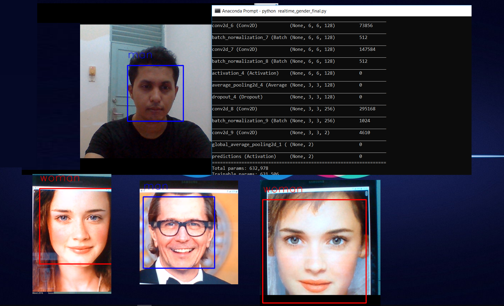

# Real-Time-Gender-Classification-with-Deep-Learning
Real Time Gender Classification with Deep Convolutional Neural Network

# IMDB-wiki Face Dataset Download

https://data.vision.ee.ethz.ch/cvl/rrothe/imdb-wiki/

*Please download faces only (7GB) md5sum
Dataset Path -= '../imdb/imdb_crop/'

# Library Installations:
 
- run: pip install -r requirements.txt in your shell.

# Usuage

Train the model - jupyter notebook >> train_genders.ipynb

Real time gender classification - python detect_genders.py

(The program will creat a window to display the scene capture by webcamera and a window representing the detected genders.)

